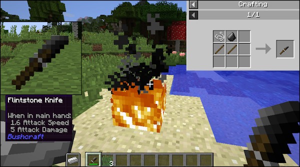

# Bushcraft — Minecraft Forge Mod (1.12)

> My first Minecraft Forge mod, originally written in November 2017. Archived as-is.



## Overview

Bushcraft adds a **Flint Knife** to early-game survival — a primitive tool crafted from flint and sticks that makes finding flint actually worthwhile.

In vanilla Minecraft, flint is one of the most underused materials. You need it for arrows and Flint & Steel, and that's about it. Bushcraft gives it more purpose right from the start.

## The Flint Knife

**Recipe:** Flint + Stick (shapeless)

**Stats:**
- 5 Attack Damage
- 1.6 Attack Speed
- Iron-tier durability (250 uses)

**Functions:**
- **Fire starting** — hold an Iron Ingot or Iron Nugget in your offhand and right-click a block to start a fire, just like Flint & Steel
- **Shearing** — works like shears: cuts grass, leaves, and shears sheep
- **Combat** — faster than a sword, slightly less damage

## Background

This was my first real Java project, written in November 2017 when I started my Computer Science (Software Engineering) degree. The codebase reflects that — it's a learning project, not production code.

Restored and archived in May 2026 as part of a legacy code recovery project.

## Build

Requires Java 8 and Forge MDK for Minecraft 1.12.

```bat
runClient.bat
```

Or manually:

```cmd
set JAVA_HOME=C:\path\to\jdk-8
set PATH=%JAVA_HOME%\bin;%PATH%
gradlew runClient --rerun-tasks
```

## Author

**Djoxer** — [djoxer.dev](https://djoxer.dev)  
Published under the OsHeaven brand (2017–2018)
